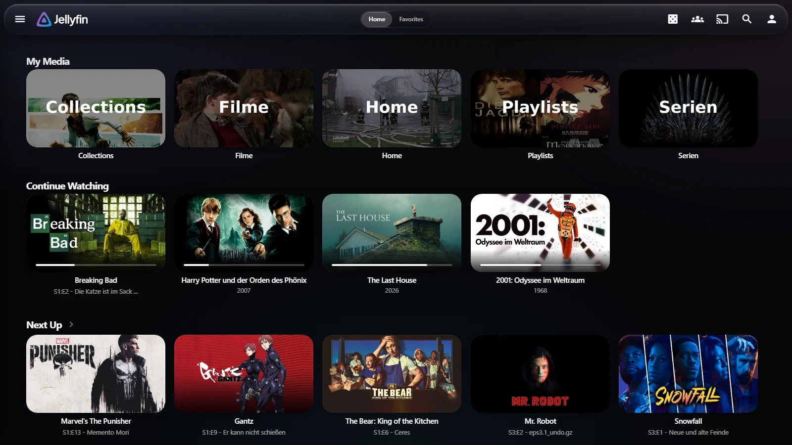
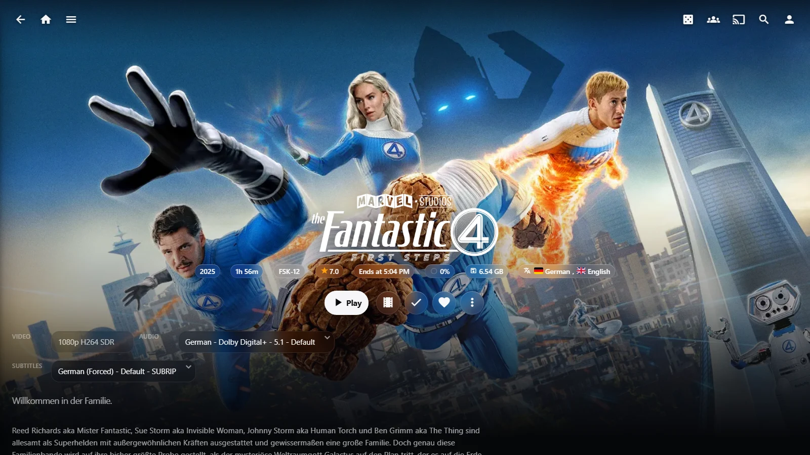
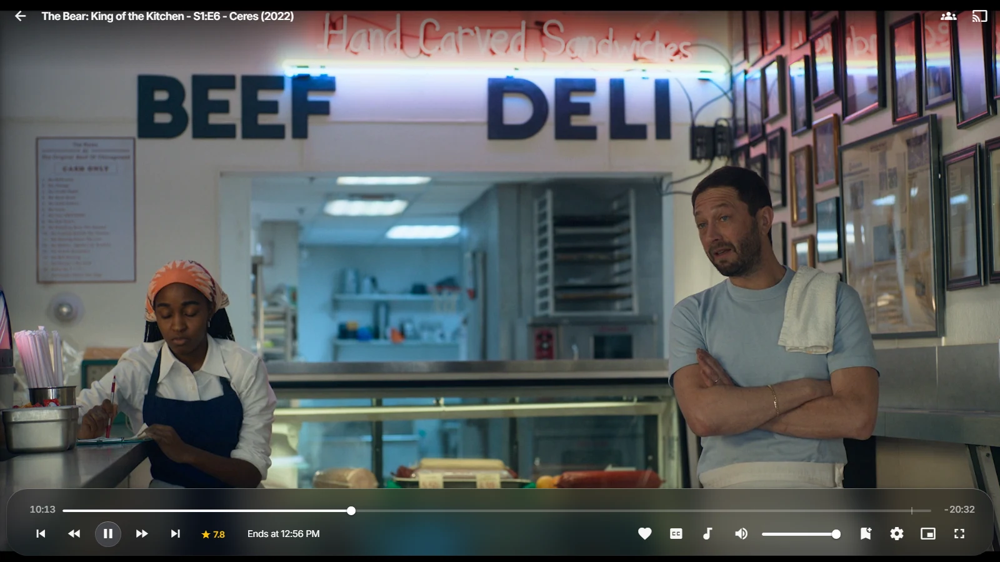

# LiquidApple

A Jellyfin theme built around Apple's Liquid Glass material: translucent panes
with refracted edges, specular rim light, capsule controls and iOS spring
motion. Dark only, and deliberately colourless — the artwork behind the glass is
what supplies the colour.

One CSS file. No JavaScript, no plugin.

## Preview



| | |
| --- | --- |
|  |  |

## Install

Dashboard → **Branding** → **Custom CSS code**, paste this and save:

```css
@import url("https://cdn.jsdelivr.net/gh/dxmoc/jellyfin-liquidapple-theme@main/dist/liquidapple.min.css");
```

Swap `@main` for a tag — `@v0.1.7` — to pin a release. `@main` follows every
change on its own, though a new one can take a while to reach you: jsDelivr
caches it for 12 hours, and your browser holds its copy longer still. The same
file is on [GitHub Pages](https://dxmoc.github.io/jellyfin-liquidapple-theme/dist/liquidapple.min.css)
if you would rather not use a CDN, or paste
[`dist/liquidapple.min.css`](dist/liquidapple.min.css) straight into the box.

`raw.githubusercontent.com` does **not** work: it serves `text/plain` with
`nosniff`, so the browser drops the stylesheet without an error.

Custom CSS reaches the web client and anything rendering the web UI. Native
apps (Android TV, Roku, Swiftfin) do not read it.

## Customise

Every value is a custom property. Redefine any of them *after* the `@import`:

```css
:root {
  --la-accent: #0a84ff;      /* iOS blue instead of neutral white */
  --la-blur: 30px;           /* thicker glass */
  --la-refract-blur: 0px;    /* switch off the refracted edge */
  --la-detail-logo: none;    /* text title instead of the film's logo */
}
```

| Token | Default | What it does |
| --- | --- | --- |
| `--la-accent` | `#f5f5f7` | Fill of the one primary action per screen |
| `--la-blur` | `22px` | Glass thickness |
| `--la-saturate` | `155%` | Colour pulled through the glass |
| `--la-refract-blur` | `6px` | Refracted outer edge; `0px` disables |
| `--la-mesh-opacity` | `1` | Ambient colour mesh behind everything |
| `--la-ground` | `#06070a` | Page background |
| `--la-detail-logo` | `block` | Show the item's logo instead of its title |
| `--la-title-weight` | `200` | Weight of the text title |

Full list: [`src/00-tokens.css`](src/00-tokens.css).

## Compatibility

Built against the Jellyfin **10.10 / 10.11** web client.

Needs `backdrop-filter`; without it the theme falls back to opaque surfaces on
its own. It also honours `prefers-reduced-transparency`, `prefers-reduced-motion`
and `prefers-contrast: more`, and switches to solid surfaces with a wider focus
ring on TV clients, where stacked blur layers are a slideshow.

Sluggish on a weak machine? Set `--la-refract-blur: 0px`, then `--la-blur: 0px`.

Nothing is loaded from anywhere else: no CDN assets, no remote images, no web
fonts. The type is whatever the machine already has — SF Pro on Apple hardware,
Segoe UI on Windows, Roboto on Android. Name a face in `--la-font` if you would
rather use your own.

## Develop

`src/*.css` is the source, `dist/` is generated, and the filename prefixes are
the cascade order — `99-fallbacks.css` must stay last.

```sh
python build.py
```

Python 3.9+, standard library only. `tools/` renders a live Jellyfin page with
the local build swapped in, which is the only reliable way to check a change;
see [`tools/README.md`](tools/README.md).

## Licence

MIT. Structural cues for which selectors matter were taken from
[ElegantFin](https://github.com/lscambo13/ElegantFin); none of its CSS is used.
